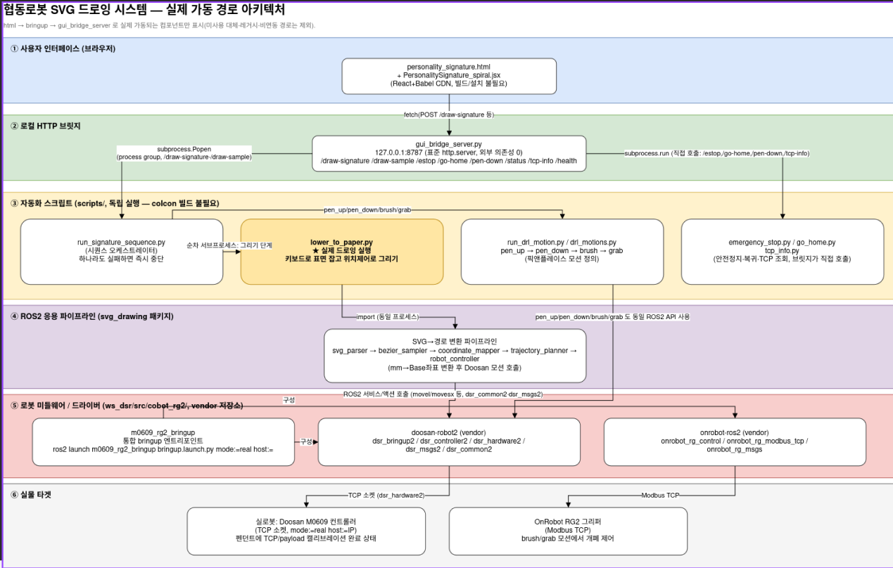
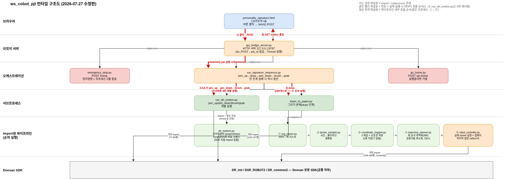

# SIGNATURE (성향 시그니처 로봇 드로잉 시스템)
> **조 이름:** [E-1 - ROKEY]
> **팀원:** [유용준_임진우_김태남_전형준_박성우]

## 1. 🎨 시스템 설계 및 플로우 차트
프로젝트의 전체적인 구조와 소프트웨어 흐름도입니다.

### 1-1. 시스템 설계도 (System Architecture)
<p align="center">
  
</p>

* *설명: 6개 레이어(① 브라우저 UI → ② 로컬 HTTP 브릿지 → ③ 자동화 스크립트 → ④ ROS2
  응용 파이프라인 → ⑤ 로봇 미들웨어/드라이버 → ⑥ 실물 타겟)로 구성됩니다. GUI는
  `fetch(POST)`로 브릿지 서버를 호출하고, 서버는 `subprocess`로 스크립트를 실행합니다.
  `svg_parser → bezier_sampler → coordinate_mapper → trajectory_planner → robot_controller`
  파이프라인이 SVG를 Base 좌표로 변환해 Doosan 드라이버(TCP 소켓)와 OnRobot 그리퍼
  (Modbus TCP)를 각각 호출합니다.*

### 1-2. 플로우 차트 (Flow Chart)
<p align="center">
  
</p>

* *설명: 실제 실행 시 데이터 흐름 순서(①~⑧)를 번호로 표시한 런타임 구조도입니다.
  ① 브라우저 클릭→POST ② 브릿지 서버가 job 실행 시작 ③,⑤,⑥,⑦ pen_up→pen_down→
  brush→grab을 순서대로 개별 실행 ④ draw 단계(내부적으로 svg_parser부터
  robot_controller까지 순차 호출) ⑧ 브라우저가 `/status`를 폴링해 진행률 확인.*

**애플리케이션 레벨 요약**: 설문(22문항) → 성향 벡터·MBTI 유형 계산 → 문양(획 좌표) 생성
→ 로봇용 JSON 전송 → 서버에서 SVG로 재조립 → 펜 집기 → 아크릴에 드로잉(힘제어) → 펜 반납
→ 붓질 → 완성판 전달 순으로 진행됩니다. 각 단계는 실패 시 안전하게 중단되고 원위치로
복귀합니다.

```
설문 응답 → 성향 분석(MBTI+벡터) → 문양 생성 → JSON 전송
   → SVG 변환 → pen_up → 그리기 → pen_down → brush → grab → 완료
```

---

## 2. 🖥️ 운영체제 환경 (OS Environment)
이 프로젝트는 다음 환경에서 개발하였습니다.

* **OS:** Ubuntu 22.04 LTS
* **ROS Version:** ROS2 Humble
* **Language:** Python 3.10 (로봇 제어), JavaScript/JSX (GUI, 브라우저 내 Babel 실시간 변환)
* **IDE:** VS Code

---

## 3. 🛠️ 사용 장비 목록 (Hardware List)
프로젝트에 사용된 주요 하드웨어 장비입니다.

| 장비명 (Model) | 수량 | 비고 |
|:---:|:---:|:---|
| Doosan Robotics M0609 (협동로봇) | 1 | 6축, 아크릴 드로잉용 |
| OnRobot RG2 (그리퍼) | 1 | 펜/붓 파지, Modbus TCP로 실제 파지 여부 검증 |
| 스크래치 펜(철필) | 1 | TCP 오프셋 약 289mm |
| 붓 | 1 | 드로잉 후 아크릴 표면 먼지 제거용 |
| 아크릴판 | 소모 | 드로잉 대상(기본 112.5mm 정사각) |
| 제어 PC | 1 | ROS2 Humble 구동, 로봇/그리퍼와 통신 |

---

## 4. 📦 의존성 (Dependencies)
프로젝트 실행에 필요한 라이브러리입니다.

* Python >= 3.10
* ROS2 Humble + Doosan 드라이버(`dsr_bringup2`, `dsr_msgs2`, `m0609_rg2_bringup` 등, 별도 설치)
* `svgelements` — SVG 파싱
* `numpy`
* `pymodbus` — OnRobot RG2 그리퍼 Modbus TCP 통신(파지 검증)
* React 18 / Babel standalone — CDN으로 로드(별도 설치·빌드 불필요, 인터넷 연결만 필요)

```bash
pip install svgelements numpy pymodbus
```

---

## 5. ▶️ 실행 순서 (Usage Guide)
프로젝트를 실행하기 위한 순서입니다. 터미널 명령어를 순서대로 입력해 주세요.

### Step 1. 로봇 초기화 — 로봇의 전원을 켜고 통신을 연결합니다.
```bash
source /opt/ros/humble/setup.bash
source ~/ws_cobot_pjt/ws_dsr/install/setup.bash
ros2 launch m0609_rg2_bringup bringup.launch.py mode:=real host:=192.168.1.100
```
> 처음 켜는 컴퓨터/로봇 조합이면 `mode:=virtual`(시뮬)로 먼저 전체 흐름을 검증하세요.

### Step 2. 브릿지 서버 실행 — GUI와 로봇을 이어주는 로컬 서버를 켭니다.
```bash
source /opt/ros/humble/setup.bash
source ~/ws_cobot_pjt/ws_dsr/install/setup.bash
cd ~/ws_cobot_pjt/ws_dsr/src/svg_drawing/scripts
python3 gui_bridge_server.py --port 8787
```

### Step 3. GUI 실행 — 브라우저에서 `personality_signature.html`을 엽니다.
```bash
# 더블클릭하거나 브라우저 주소창에 파일 경로를 입력해서 열면 됩니다.
# (React/Babel을 CDN에서 불러오므로 최초 실행 시 인터넷 연결 필요, 별도 설치 불필요)
```
설문을 완료하면 결과 화면에서 **[로봇으로 그리기]** 버튼으로 전체 시퀀스(펜집기 →
드로잉 → 펜반납 → 붓질 → 완성판 전달)를 실행할 수 있습니다.

### (선택) 터미널에서 SVG 한 장만 바로 그리기
```bash
python3 ~/ws_cobot_pjt/ws_dsr/src/svg_drawing/scripts/lower_to_paper.py --svg samples/merkaba.svg
```

---

## 6. 📁 프로젝트 구조 & 상세 사양
GUI 구성/기능, 그리기 파이프라인 파라미터, 안전장치, FAQ 등 개발 상세 문서는
[`DEVELOPMENT.md`](DEVELOPMENT.md)를 참고하세요.
